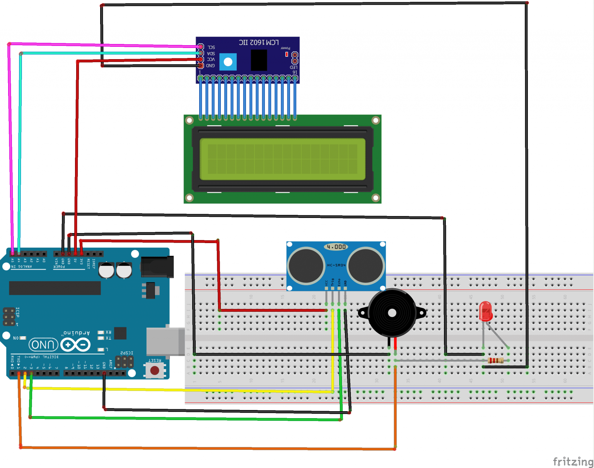

## Composants nécessaires
	* une carte Arduino UNO
	* Un détecteur à ultrason (Ultrasonic sensor – HC-SR04)
	* Un buzzer
	* 1 résistance de 220Ω
	* 1 LED rouge
	* des fils de connexion

## Montage
	Pour réaliser le montage, on peut connecter

#### Pour LED et Buzzer:
		* les bornes (+) de la LED rouge et du buzzer  à la borne numérique N°1 de l’Arduino
		* les bornes (-) de la LED rouge et du buzzer  à la borne GND de l’Arduino

#### Pour le capteur HC-SR04:
	* la broche TRIG du capteur à ultrason à la borne numérique N°2 de l’Arduino
	* la broche Echo du capteur à ultrason à a borne numérique N°3 de l’Arduino.
	* la broche VCC du capteur à ultrason à la borne 3.3V de l’Arduino
	* la broche GND du capteur à ultrason à la borne GND de l’Arduino

#### Pour l’afficheur LCD:
	* la broche VCC  à la borne 5V de la carte Arduino
	* la broche GND du relais  à la borne GND de la carte Arduino
	* la broche SDA à la borne analogique A4 de la carte Arduino
	* la broche SCL à la borne analogique A5 de la carte Arduino

